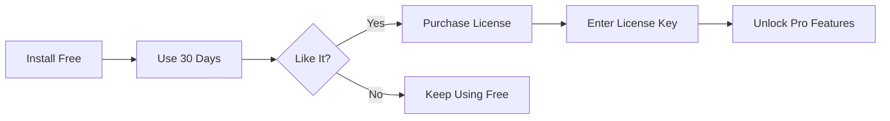

# Licensing Quick Reference

This is a quick reference for understanding and using Linear Buddy's licensing model.

## 📊 Quick Comparison

| Feature | Free (MIT) | Pro (Commercial) |
|---------|-----------|------------------|
| **View Linear tickets** | ✅ | ✅ |
| **Create/update tickets** | ✅ | ✅ |
| **Convert TODOs to tickets** | ✅ | ✅ |
| **Branch management** | ✅ | ✅ |
| **Basic AI summaries** | ✅ | ✅ |
| **Chat interface** | ✅ | ✅ |
| **GitHub permalinks** | ✅ | ✅ |
| **Advanced analytics** | ❌ | ✅ 💎 |
| **Smart prioritization** | ❌ | ✅ 💎 |
| **Team dashboard** | ❌ | ✅ 💎 |
| **Custom workflows** | ❌ | ✅ 💎 |
| **Multi-workspace** | ❌ | ✅ 💎 |
| **Custom theming** | ❌ | ✅ 💎 |
| **Priority support** | ❌ | ✅ 💎 |
| **Enterprise SSO** | ❌ | ✅ 💎 |

## 🚀 Getting Started

### For Free Users
```bash
# 1. Install extension
# 2. Configure Linear API key
# 3. Start using immediately - no license needed!
```

### For Pro Users
```bash
# 1. Purchase license at [URL]
# 2. Open Command Palette (Cmd/Ctrl + Shift + P)
# 3. Run: "Linear Buddy: Activate Pro License"
# 4. Enter your license key
# 5. Enjoy Pro features! ✨
```

## 🔑 Commands

| Command | Description |
|---------|-------------|
| `Linear Buddy: Activate Pro License` | Enter and activate your Pro license key |
| `Linear Buddy: Show License Info` | View your current license status |
| `Linear Buddy: Deactivate License` | Remove license from this machine |

## 💡 Pro Feature Indicators

Throughout the UI, Pro features are marked with:
- 💎 Pro badge
- "Upgrade to Pro" prompts
- Feature locked states

## 🎁 Free Pro Licenses

We offer free Pro licenses to:
- 🎓 **Students** - Verify with student email
- 🌟 **Open source maintainers** - Link to your projects
- 💚 **Non-profit organizations** - Provide documentation
- 🤝 **Contributors** - Contribute code to get free access!

Contact angelo.girardi@onebrief.com to apply.

## 🏢 For Organizations

### Seat-Based Licensing
- Each team member needs a license
- Centralized management portal (Enterprise)
- Volume discounts available
- Annual billing preferred

### License Transfer
- Deactivate on old machine
- Activate on new machine
- Or use same email on multiple devices
- Enterprise: Admin manages all seats

## ⚖️ License Terms Summary

### MIT License (Free Features)
```
✅ Commercial use
✅ Modification
✅ Distribution
✅ Private use
❌ Liability
❌ Warranty
```

### Commercial License (Pro Features)
```
✅ Use with valid license
✅ Use on multiple devices (same email)
✅ 30-day free trial
✅ Source code visibility
❌ Share license keys
❌ Remove license checks
❌ Use without license after trial
```

## 📞 Support Channels

### Free Users
- 📝 GitHub Issues
- 💬 Community Discord
- 📚 Documentation

### Pro Users
- 📧 **Priority Email**: angelo.girardi@onebrief.com
- 🎫 **Support Portal**: [URL]
- ⚡ **Response Time**: < 24 hours
- All free user channels

## 🔄 Upgrade Process



## ❓ Common Questions

**Q: What happens after trial?**
A: Free features continue working. Pro features show upgrade prompts.

**Q: Can I use offline?**
A: Yes, 7-day offline grace period after last validation.

**Q: Refund policy?**
A: 30-day money-back guarantee, no questions asked.

**Q: Educational discount?**
A: Yes! 50% off for verified students and educators.

**Q: Can I try Pro before buying?**
A: Yes! 30-day free trial, no credit card required.

**Q: How many devices?**
A: Unlimited devices with same email address.

## 🛡️ Privacy & Security

- ✅ License keys stored in VS Code SecretStorage
- ✅ Encrypted transmission (HTTPS)
- ✅ No telemetry without consent
- ✅ Source code available for audit
- ✅ GDPR compliant
- ✅ No data sold to third parties

## 📈 Pricing

### Personal
- **$8/month** or **$80/year** (save $16)
- All Pro features
- Single user
- All devices

### Team
- **$20/user/month** or **$200/user/year**
- Everything in Personal
- Team analytics
- Centralized billing
- Priority support

### Enterprise
- **Custom pricing**
- Everything in Team
- SSO integration
- Custom contracts
- Dedicated support
- On-premise options

## 🎯 Next Steps

1. **Try it**: Install and use free features
2. **Explore**: Use Pro trial for 30 days
3. **Decide**: Choose to upgrade or stay free
4. **Share**: Tell others about Linear Buddy!

---

**Need help?** 
- 📧 Email: angelo.girardi@onebrief.com
- 🐛 Issues: GitHub Issues
- 📖 Docs: [Documentation URL]

**Last Updated:** November 7, 2025

